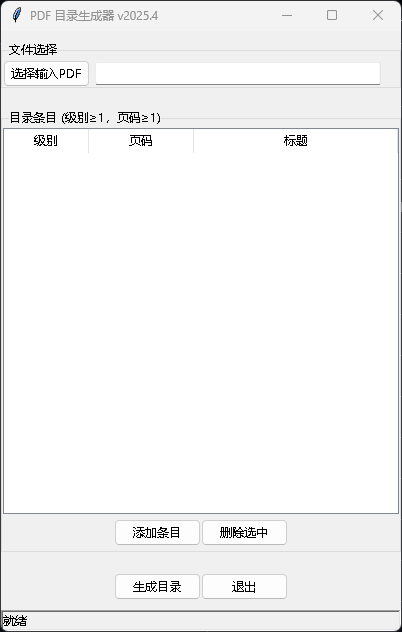
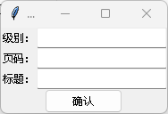
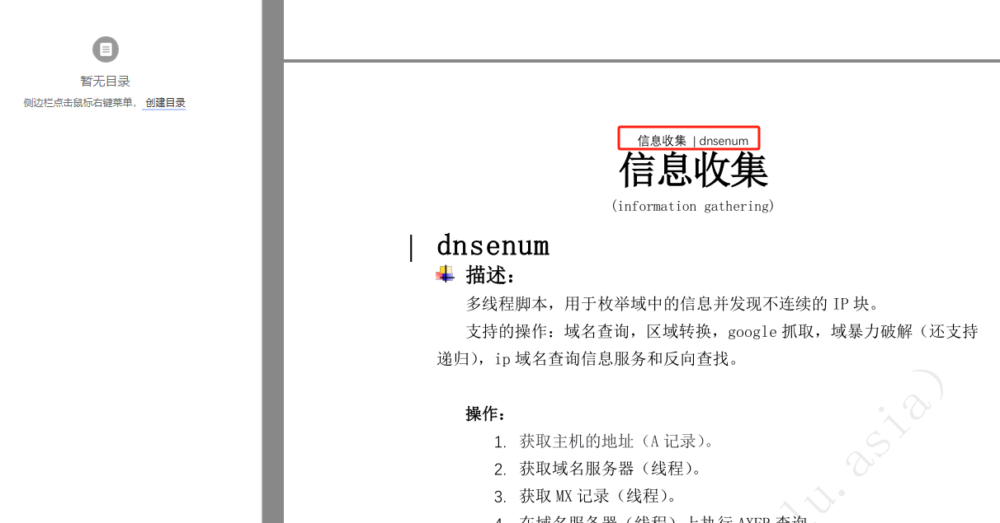
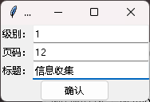
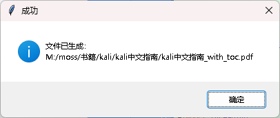
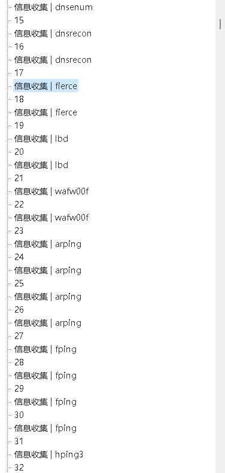

# pdf_creat_toc

基于[pdf.tocgen](https://github.com/Krasjet/pdf.tocgen)实现的PDF自动添加目录程序

下载依赖

```
pip install  pdf.tocgen
```

目前可以完成一层目录自动添加，但二层目录时会报错，

有志之士可以进行完善

### 使用说明



选择好对应的文件后，可以添加条目



级别是1，页面是你决定要选择这本书中取哪一类字符作为目录

例如：



本页选取红框内为标题示例，则填写如下。



点击生成目录即可。



效果如下

